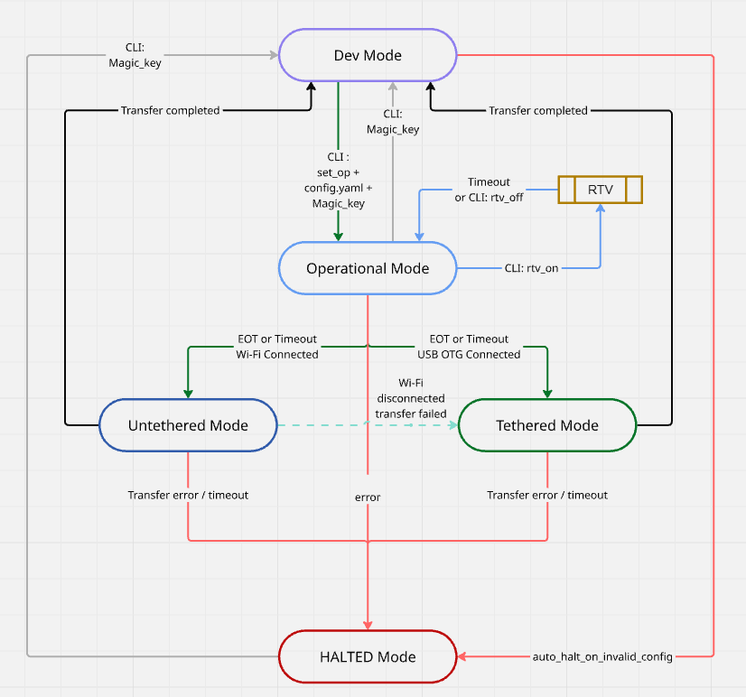

# 🌟 OptiPulse™State: Developer Training Project

Welcome to **OptiPulse™State**, a hands-on embedded systems learning project focused on mastering **FreeRTOS**, **state machines**, **LED control**, **CLI interaction**, and **real-time camera streaming** — all on the ESP32-S3.

This project mimics a simplified embedded operating state machine, commonly used in real-world firmware systems, with **defined states**, **LED-based feedback**, **timed logic**, and **robust transition handling**.

---

## 📌 Project Purpose

To serve as a **learning platform** for embedded software and firmware design by:

- Practicing state machine implementation
- Applying FreeRTOS and multitasking
- Managing peripheral control (LED, camera, SD card)
- Handling persistent config (NVS and YAML parsing)
- Exploring real-world patterns like CLI tools and recovery logic

---

## ⚙️ Architecture Overview

### 🔁 State Machine Logic

The core of the system is built around a **finite state machine (FSM)** with the following states:

1. **DEV_MODE**  
   - Full CLI access over UART  
   - LED control commands (on, off, blink, duty cycle, frequency, etc.)  
   - Wi-Fi scanning and connection via CLI  
   - Real-time logs printed every ≤1s  
   - Loads configuration from a YAML file  
   - Magic key required to switch states  

2. **OPERATIONAL**  
   - LED behavior driven by config or runtime status  
   - Logs saved to SD card  
   - Real-Time View (RTV) supported with a timer-based session  
   - On command, splits into:
     - **TETHERED**:  
       ↳ USB-connected; allows log transfer to PC, uses slow LED blink  
     - **UNTETHERED**:  
       ↳ Wi-Fi log upload to cloud, with fallback to Tethered if failure occurs  
       ↳ LED reflects network activity  

3. **HALTED**  
   - LED blinks rapidly at 5Hz  
   - System enters deep sleep indefinitely  
   - Can only be resumed by sending a CLI command with the **magic key**  

---

## 🧠 Learning Outcomes

By completing this project, you'll develop:

| Skill / Concept                     | Description                                                                 |
|------------------------------------|-----------------------------------------------------------------------------|
| Embedded State Machines            | Design and manage FSM logic with safe transitions                          |
| FreeRTOS                           | Task creation, delay handling, and multitasking principles                 |
| GPIO Control                       | Blinking LED patterns, pulse width control, and status indication          |
| UART CLI                           | Custom command handler for real-time interaction                           |
| SD Card Integration                | Log writing, retrieval, and structured debug storage                       |
| Camera Streaming                   | Timer-based real-time view with adaptive feedback                          |
| YAML Configuration Parsing         | Load startup parameters, Wi-Fi info, LED behavior, and secure keys         |
| Persistent Storage (NVS)           | Store critical state to resume after resets or crashes                     |

---

## 📐 System Diagram



---

## 📂 Project Structure (Simplified)

```

optipulse\_state/
│
├── main/
│   ├── main.c               # Entry point (previously blink\_led.c)
│   ├── cli\_handler.c/h      # UART CLI parser and command dispatcher
│   ├── state\_machine.c/h    # FSM transitions, state logic, resume logic
│   ├── led\_controller.c/h   # LED patterns and timed control
│   ├── config\_loader.c/h    # YAML parsing and loading logic
│   ├── camera\_handler.c/h   # Real-time view (RTV) logic with timer
│   ├── storage\_manager.c/h  # SD card or NVS storage interactions
│   └── transfer\_manager.c/h # Tethered / Untethered log transfer (future)
│
├── sdkconfig                # ESP-IDF config
├── README.md                # This file
└── CMakeLists.txt           # Build instructions

```

---

## 🔧 Bill of Materials (BOM)

| Component                     | Description                        |
|------------------------------|------------------------------------|
| ESP32-S3 WROOM Board         | Main MCU with camera + SD support  |
| Onboard GPIO2 LED            | For visual feedback                |
| MicroSD Card (1GB+)          | For logging                        |
| USB-C Cable (2x)             | One for UART CLI, one for OTG if needed |
| Optional: PC or phone        | For viewing RTV or transferring logs |

---

## 🛠️ Tools & Software Used

| Tool / Lib                   | Purpose                                      |
|-----------------------------|----------------------------------------------|
| [ESP-IDF](https://docs.espressif.com/projects/esp-idf/en/latest/esp32/) | Core framework for ESP32-S3 development |
| FreeRTOS                    | Multitasking kernel                          |
| YAML Parser (e.g., libyaml) | Reading configuration files                  |
| UART CLI (custom)           | Serial command interface                     |
| VS Code + ESP-IDF Plugin    | Development environment                      |
| Miro / Mermaid / Draw.io    | State machine and architecture diagrams      |
| Git                         | Version control                              |

---

## 🧭 Roadmap / Phases

- [x] Phase 1: LED + Logger (Completed)  
- [x] Phase 2: Add CLI + Config YAML + State Transitions  
- [ ] Phase 3: Add SD Card Logging + Persistent State Save  
- [ ] Phase 4: Add Camera + Real-Time View logic  
- [ ] Phase 5: Implement Tethered / Untethered Flow  
- [ ] Phase 6: Error Recovery + Auto Resume + OTA (future)

---

## 🔐 Security & Reset Logic

- Magic key embedded in YAML file  
- Required to move into or out of restricted states (e.g., HALTED)  
- NVS stores last state and resets return to same state unless configured otherwise  
- RTV session resets **do not** automatically restart the stream

---

## ✅ Final Notes

This project blends **professional firmware architecture** with **educational design principles**, making it perfect for anyone serious about embedded systems development and system-level design patterns.

---

> © 2025 Dark Bors — Learning by doing, one LED pulse at a time.
```
