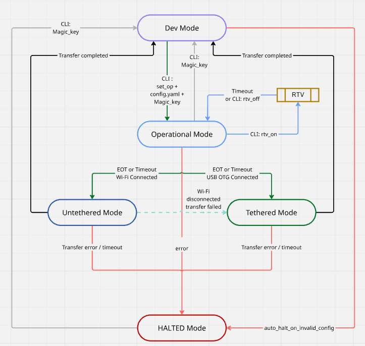
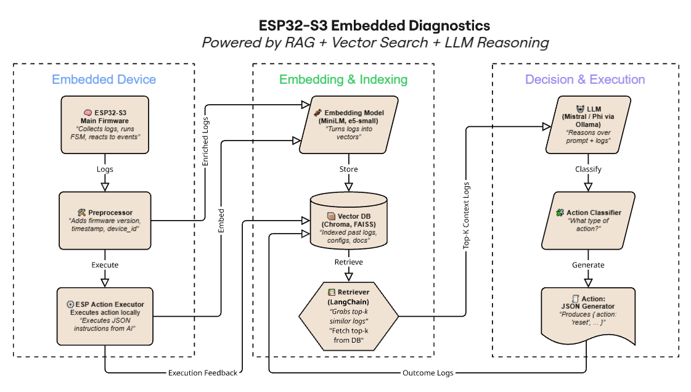

# 🌟 ESP32-S3: Full Embedded AI Diagnostic Project (OptiPulse™State)

Welcome to **OptiPulse™State**, a comprehensive embedded systems learning project focused on mastering FreeRTOS, finite state machines (FSMs), LED pattern control, CLI interaction, and AI-assisted fault diagnostics using RAG and LLM — all running on the ESP32-S3.

This project models a real-world, production-inspired firmware architecture and introduces AI-based autonomous error handling and recovery.

>**Project Type**: Educational / AI-Augmented Firmware Prototype
>
>**Target MCU**: ESP32-S3-WROOM-1
>
>**Key Features**: FreeRTOS, FSM, CLI, SD logging, real-time camera view (RTV), AI diagnostics (offline RAG+LLM)

---

## 📦 File Structure Overview

```markdown
ESP32-FIRST-EMBEDDED-PROJECT/
├── main/                         # Core FreeRTOS + FSM firmware modules
│   ├── cli_handler.c/h          # UART CLI command handler
│   ├── config_parser.c/h        # YAML config reader
│   ├── led_handler.c/h          # LED logic (patterns, timers)
│   ├── nvs_helper.c/h           # Persistent NVS storage wrapper
│   ├── rtv_handler.c/h          # Real-Time View module (camera/timer)
│   ├── security.c/h             # Security GPIO levels + access gating
│   ├── state_machine.c/h        # Main FSM logic
│   ├── version_config.h         # FW versioning
│   └── main.c                   # Main startup logic
├── tools/                       # Dev tools / utilities
│   ├── flash_and_log.bat        # Flash and log helper
│   └── save_memory_report.py    # Save mem report snapshots
├── memory_reports/              # Auto-saved memory usage logs
├── diagrams/                    # Architecture, flow, timing graphs 
│   ├── state_machine_diagram.png
│   ├── LED_pattern_timing.png
│   └── system_architecture.png
├── sdkconfig / sdkconfig.old    # ESP-IDF build configs
├── CMakeLists.txt               # Root CMake
├── README.md                    # This doc
└── temp_flash_script.ps1        # Flash helper (PowerShell)
```

---

## 🔦 LED Pattern Overview

The LED feedback is driven entirely by `led_handler.c`, using **esp\_timer** for precise pattern scheduling. Patterns are encoded as enums and mapped to runtime-tunable logic:

| Pattern             | Description                               | Timing                        | Type       |
| ------------------- | ----------------------------------------- | ----------------------------- | ---------- |
| `DEV_MODE`          | Static ON                                 | Constant                      | Static     |
| `OPERATIONAL`       | Burst blink pattern (10ms x5) + pause     | 10ms ON/OFF ×5, 50ms pause    | Burst      |
| `RTV_ACTIVE`        | 5 rapid blinks at 100Hz + 500ms pause     | 50ms ON/OFF ×5, 500ms pause   | Burst      |
| `HALTED_ENTRY`      | Blink at 2Hz for 5 seconds, then hold OFF | 100ms ON/OFF ×10              | Timed      |
| `TRANSFER_COMPLETE` | 1Hz blink pattern                         | 500ms ON / 500ms OFF          | Continuous |
| `TETHERED`          | Slow blink at 0.5Hz                       | 1s ON / 1s OFF                | Continuous |
| `UNTETHERED`        | 10× 250ms blinks + 500ms pause            | 250ms ON/OFF ×10, 500ms pause | Burst      |

Advanced logic also includes:

* Support for runtime-configured `led_blink(frequency, duty_cycle)`
* Future expansion for PWM fade and pulse patterns (not yet implemented)
* Debug CLI function: `led_debug_status()` prints pattern, counters, state

📁 See: `main/led_handler.c`

---

## 🎯 Project Objectives

* Learn full-stack embedded architecture on ESP32
* Create reliable FSM with security gating, CLI, and fault recovery
* Add real-time observability via camera and log feedback
* Prototype self-healing logic via RAG + LLM agent (local + offline)

---

## 🧠 System Overview

| Component          | Role                                        |
| ------------------ | ------------------------------------------- |
| ESP32 Firmware     | FSM logic, CLI, config, LED, self-test      |
| UART/USB Comm      | CLI access, config upload, log transfer     |
| AI Host Agent      | Monitors logs, generates fix suggestions    |
| Vector DB (local)  | Stores embedded logs, config examples, docs |
| Local LLM (Ollama) | Executes diagnostic reasoning + responses   |

---

## 🔁 State Machine Overview

The firmware operates as a deterministic **finite state machine (FSM)**, defined in `state_machine.c`. It orchestrates system behavior across modes based on CLI input, runtime context, or automatic decision logic.

### 🧭 States

| State Name     | Description |
|----------------|-------------|
| `DEV_MODE`     | Developer/debug state. Full CLI access, LED always ON. |
| `OPERATIONAL`  | Normal system execution with log generation and monitoring. Can branch into submodes. |
| `TETHERED`     | Device is connected via USB-OTG. Logs or data are transferred directly. |
| `UNTETHERED`   | Wi-Fi-enabled operation with log upload. Falls back to tethered if transfer fails. |
| `HALTED`       | Entered on critical fault, timeout, or invalid config. Requires secure CLI to resume. |

---

### 🔄 Transitions

| From → To        | Trigger Condition |
|------------------|------------------|
| DEV_MODE → OPERATIONAL | CLI: `set_op config.yaml + magic_key` |
| OPERATIONAL → TETHERED | USB OTG connected, EOT or timeout |
| OPERATIONAL → UNTETHERED | Wi-Fi connected, EOT or timeout |
| TETHERED/UNTETHERED → OPERATIONAL | Transfer completed |
| Any → HALTED     | Config error, CRC failure, transfer error, or watchdog timeout |
| HALTED → DEV_MODE | CLI: `magic_key` (with security level ≥ 3) |

> Note: State transitions are always validated against current `security_level`.

---

### ⌛ Timeouts + Error Handling

- **RTV timeout**: Forces exit back to OPERATIONAL
- **Wi-Fi disconnect during UNTETHERED**: Fall back or enter HALTED
- **Auto-halt**: If invalid YAML config or memory test fails at boot

---

### 📦 FSM Entry Points

- `state_machine_init()`  
- `state_machine_run_loop()`  
- `state_machine_transition(target_state)`  

Each is defined and dispatched based on event queues, CLI, or error recovery handlers.

---

### 📊 State Diagram



---

## 🤖 Autonomous Diagnostic Pipeline (RAG + LLM)

### Description

This module enables closed-loop fault diagnostics:

1. 📤 Logs from ESP32 are enriched with metadata and sent to host
2. 🧠 Logs are embedded into vectors using SentenceTransformers (MiniLM, e5-small)
3. 🔍 Vector DB (Chroma / FAISS) stores and retrieves relevant past logs
4. 🔁 LangChain builds prompts from the top-K most similar cases
5. 💬 LLM (Mistral or Phi via Ollama) reasons and generates the best action
6. 📄 JSON Action is produced and returned to the ESP for execution
7. ✅ Execution result is logged and optionally re-embedded for feedback

### Architecture Flow



---

### Example JSON Action

```json
{
  "action": "use_backup_reg",
  "target_register": "0x3FA4",
  "reason": "CRC mismatch in boot config register 0x3FA0",
  "retry": true
}
```

---

## 📚 Key Modules Explained

* `cli_handler.c` → UART command handler, supports magic key, secure transitions
* `config_parser.c` → YAML config loader for Wi-Fi, LED, debug, etc.
* `led_handler.c` → LED pattern engine
* `nvs_helper.c` → Persistent storage for last state, config
* `rtv_handler.c` → (Planned) real-time camera session
* `security.c` → Reads GPIO access level (3 pins → 4 security levels)
* `state_machine.c` → FSM driver, transition logic, error handling
* `ai_action_executor.c` → Parses action JSON and executes on ESP32 (planned)

---

## 🧱 Platform Specs + AI Toolchain

### 🔧 ESP32 Hardware Platform

| Spec                | Detail                               |
| ------------------- | ------------------------------------ |
| MCU                 | ESP32-S3-WROOM (DevKitC-1)           |
| CPU                 | 32-bit Xtensa LX7 dual-core @240 MHz |
| RAM                 | 512 KB (plus 16 KB RTC fast SRAM)    |
| ROM                 | 384 KB                               |
| Interfaces          | Wi-Fi, BLE, USB-OTG, SD/MMC          |
| Flash / Storage     | External SPI flash + microSD (1GB+)  |
| Debug/CLI Interface | USB (UART), custom CLI               |
| Visual Output       | GPIO2 LED (blinking feedback)        |

---

### 🛠️ Tools & Software Stack

| Tool / Library                | Purpose                                   |
| ----------------------------- | ----------------------------------------- |
| **ESP-IDF**                   | Core framework for ESP32-S3 development   |
| **FreeRTOS**                  | Real-time task scheduling and concurrency |
| **libyaml / yaml\_parser.c**  | YAML config parsing from SD card          |
| **UART CLI (custom)**         | Serial command interface                  |
| **VS Code + ESP-IDF Plugin**  | Primary development IDE                   |
| **Git**                       | Version control                           |
| **Draw\.io / Mermaid / Miro** | Diagrams (FSM, RAG, architecture)         |
| **Python** (host agent)       | RAG pipeline, test framework              |
| **Ollama**                    | Local LLM runner (offline)                |
| **Mistral / Phi**             | Reasoning models (7B, 3B)                 |
| **ChromaDB / FAISS**          | Vector DB for embedding search            |
| **SentenceTransformers**      | Text embedding models (MiniLM, e5-small)  |
| **LangChain**                 | Retrieval and prompt orchestration        |

---

## 🔐 Security Access Layer

The system enforces access control using a **3-pin GPIO-based hardware security pattern**, designed for boot-time and CLI-level privilege detection. Each boot, the GPIO pins (GPIO18, GPIO19, GPIO21) are read and converted to a 3-bit level between 0–7, mapped to 4 practical access levels.

### ✅ Security Levels

| Level | Symbol | Description                          | GPIO Pattern (18,19,21) |
|-------|--------|--------------------------------------|--------------------------|
| 0     | 🚫     | No access – CLI disabled             | `000`                    |
| 1     | 🛠     | Limited – CLI view-only              | `001`                    |
| 2     | ⚙️     | Config + Log access                   | `110`                    |
| 3     | 🔐     | Full Dev access (reset, unlock, HALT)| `101`                    |

---

### 🧩 Security Logic Design

#### 🔄 Source

- Physical input via GPIO18, GPIO19, GPIO21
- Read during boot via:
  ```c
  int get_security_level_from_gpio(void);

#### 🧠 Runtime Usage

* Stored in global `security_level` (visible in `state_machine.c`, `cli_handler.c`)
* Used to **gate CLI actions**, critical commands, and state transitions:

  ```c
  if (security_level >= 2) {
      // Allow YAML view/set, log access
  }
  if (security_level == 3) {
      // Allow state control, HALT recovery, NVS reset
  }
  ```

#### 🔐 Magic Key Logic (Temporary Access)

* Currently implemented as a **plaintext CLI key** for entering OP mode:

  ```c
  #define MAGIC_KEY "unlocked_dev_123"
  ```

* **Future plan**:

  * Encrypted Magic Key (AES-256)
  * SHA256 signature check
  * Secure Boot using ESP32 eFuse

---

### ⚠️ Fail-Safe Handling

| Condition                      | System Response            |
| ------------------------------ | -------------------------- |
| Invalid GPIO pattern (not 0–3) | Fallback to `SEC_LEVEL_0`  |
| No security config present     | Treat as `SEC_LEVEL_0`     |
| Level 0 detected               | Most CLI commands disabled |

---

### 🔒 CLI Command Permissions

| Command / Action        | Min Security Level |
| ----------------------- | ------------------ |
| `status`                | 1                  |
| `logs view`             | 2                  |
| `config set`            | 2                  |
| `state set OPERATIONAL` | 3                  |
| `rtv_on`, `rtv_off`     | 2                  |
| `reset_nvs`             | 3                  |
| `halt`                  | 3                  |

📁 Source: `main/security.c`, `main/cli_handler.c`, `main/state_machine.c`

---

Thank you — that’s clear now. Based on your clarification, here is the updated and **accurate Project Roadmap** reflecting your **true implementation status**:

---

## 🧭 Project Roadmap

### ✅ Phase 1: Core Firmware Foundation

- ☑️ FSM with `DEV` / `OPERATIONAL` / `HALTED` / `TRANSFER` states
- ☑️ LED Pattern Engine (`esp_timer`-based)
- ⬜ CLI Handler with Magic Key + Security Levels *(files created, logic not yet implemented)*
- ⬜ NVS integration for persistent config *(helpers stubbed only)*
- ⬜ UART Logging + Debug Interface *(basic debug prints only, no SD log storage yet)*

---

### 🔄 Phase 2: RAG Integration & AI Engine

- ☑️ RAG + LLM Architecture Design + Diagrams
- ⬜ Log-to-Vector embedding (host-side Python)
- ⬜ Local RAG pipeline with ChromaDB + LangChain
- ⬜ Prompt → LLM (Ollama / Mistral) → Action JSON
- ⬜ `ai_action_executor` on ESP (parse & apply JSON actions)
- ⬜ Feedback loop: log → reason → retry / adapt

---

### 🔬 Phase 3: Observability & Real-Time View (RTV)

- ⬜ Camera integration (OV2640 or similar)
- ⬜ Timed RTV sessions with CLI trigger
- ⬜ Capture + stream + compress logs/images
- ⬜ CLI command: `rtv_on`, `rtv_off`

---

### 🛡️ Phase 4: Robustness & Security

- ⬜ Enhanced GPIO-based Security (live check + override)
- ⬜ AES-encrypted Magic Key handling
- ⬜ Secure Boot and eFuse config (ESP-IDF)

---

### 🚀 Phase 5: OTA + Productionization

- ⬜ OTA firmware upgrade support
- ⬜ Rollback fail-safe
- ⬜ Embedded AI telemetry export
- ⬜ Power consumption profiling (`FreeRTOS` idle hook)

---

## 📎 Related Diagrams

* ✅ `state_machine_diagram.png`
* ✅ `LED_pattern_timing.png`
* ✅ `esp32_rag_llm_architecture.png`
* 🔲 `data_flow_rag_stack.png` → *(placeholder)*
* 🔲 `esp32_memory_map_debug_view.png` → *(planned)*

---

## 🧠 Final Notes

This project is a hands-on, industry-aligned exercise in building smart firmware systems that go beyond reactive code — embracing autonomous reasoning and recovery mechanisms powered by embedded AI.

It serves as a powerful blueprint for:

* Embedded engineers interested in AI-augmented systems
* Firmware teams exploring closed-loop diagnostics
* Learners who want to bridge FreeRTOS and GenAI tooling

> 💡 *Next milestone: full self-repairing OTA logic + anomaly forecasting.*

© 2025 Dark Bors | *Powered by blinking LEDs and intelligent logs*

---
